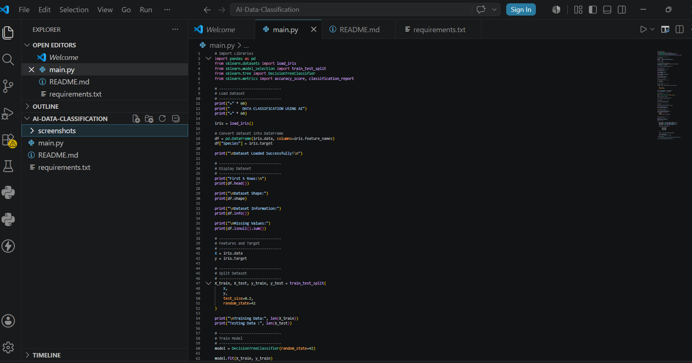
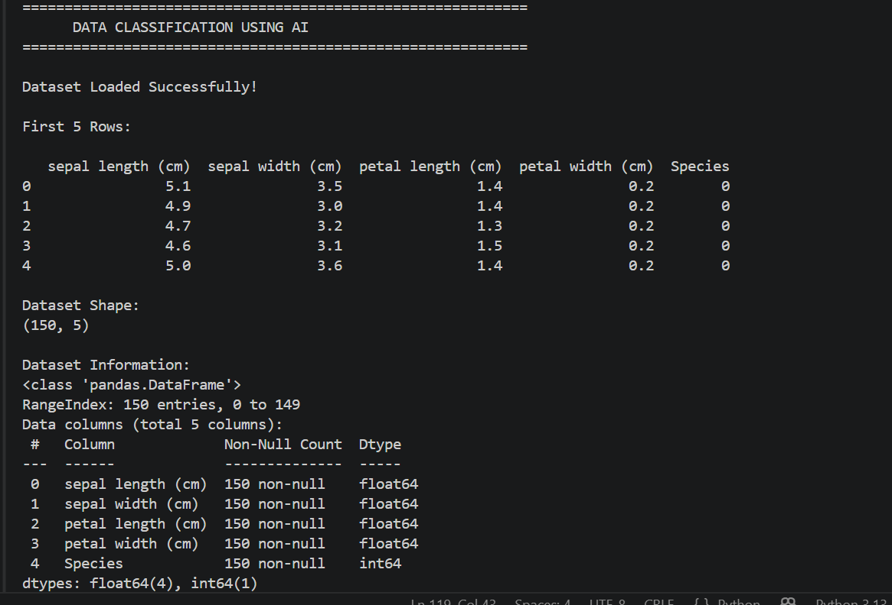
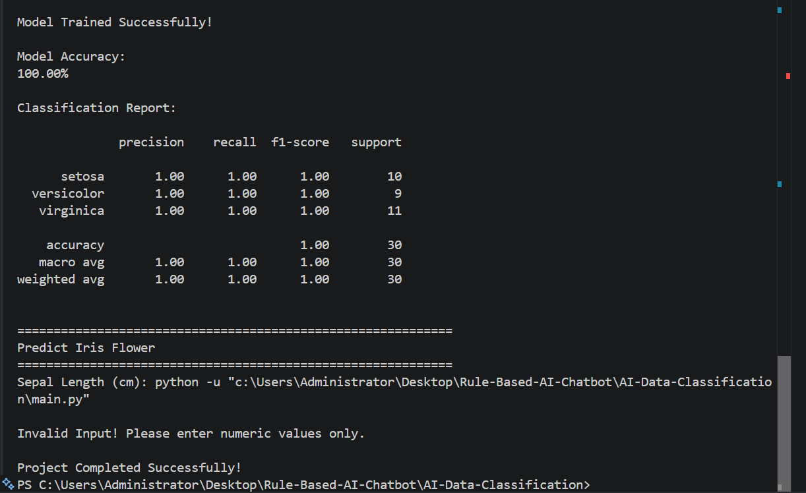

#  Data Classification Using AI

##  Project Overview

This project was developed as **Project 2** during the **DecodeLabs Artificial Intelligence Internship (Batch 2026)**.

The objective of this project is to build a **Machine Learning Classification Model** that can classify Iris flowers into different species based on their features using the **Decision Tree Classification Algorithm**.

The project demonstrates the complete machine learning workflow, including data loading, preprocessing, model training, testing, evaluation, and prediction.

---

#  Features

- Load the Iris dataset
- Display dataset information
- Handle features and target labels
- Split dataset into training and testing sets
- Train a Decision Tree Classifier
- Evaluate model accuracy
- Generate Classification Report
- Predict flower species from user input
- Simple and beginner-friendly implementation

---

#  Technologies Used

- Python 3
- Pandas
- Scikit-learn

---

#  Machine Learning Concepts

This project covers the following AI concepts:

- Supervised Learning
- Classification
- Decision Tree Algorithm
- Model Training
- Model Testing
- Accuracy Evaluation
- Prediction

---

#  Project Structure

```
AI-Data-Classification/
│
├── main.py
├── README.md
├── requirements.txt
└── screenshots/
    ├── code.png
    ├── output.png
    └── prediction.png
```

---

# ▶ Installation

Clone the repository:

```bash
git clone https://github.com/zari12-dev/AI-Data-Classification.git
```

Go to the project directory:

```bash
cd AI-Data-Classification
```

Install required libraries:

```bash
pip install -r requirements.txt
```

Run the project:

```bash
python main.py
```

---

#  Dataset

This project uses the **Iris Dataset**, which is provided by the **Scikit-learn** library.

The dataset contains:

- 150 samples
- 4 input features
- 3 flower classes

Features:

- Sepal Length
- Sepal Width
- Petal Length
- Petal Width

Classes:

- Iris Setosa
- Iris Versicolor
- Iris Virginica

---

#  Model Performance

Algorithm Used:

- Decision Tree Classifier

Evaluation Metric:

- Accuracy Score
- Classification Report

---

#  Screenshots

## Source Code

> 


```
screenshots/code.png
```

---

## Program Output

> 

```
screenshots/output.png
```

---

## Prediction Result

>

```
screenshots/prediction.png
```

---

# 🎯 Learning Outcomes

Through this project I learned:

- Data Classification
- Machine Learning Workflow
- Decision Tree Algorithm
- Data Splitting
- Model Training
- Model Evaluation
- Prediction using AI
- Working with Scikit-learn

---

# 🔮 Future Improvements

- GUI using Tkinter
- Multiple Classification Algorithms
- Confusion Matrix Visualization
- Data Visualization using Matplotlib
- Model Comparison
- Export Trained Model

---

# 👨‍💻 Author

**Zartaj Nadeem**

Artificial Intelligence Intern

DecodeLabs (Batch 2026)

---

# ⭐ Acknowledgements

Special thanks to **DecodeLabs** for providing this project as part of the Artificial Intelligence Internship Program.